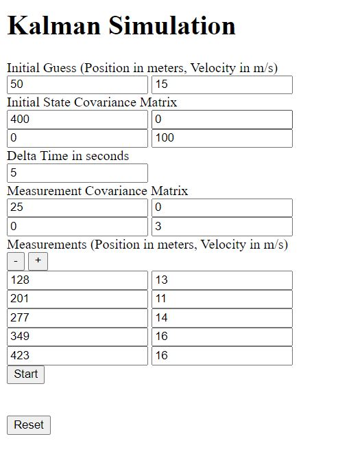
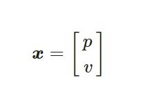

# Unidimensional Kalman Filter Simulation
The Kalman filter is a sequential estimation process that provides an optimal estimate 
of the evolution of a system, given noisy measurements and a limited knowledge about the system. 
The standard filter is designed for linear systems and is now widely 
used in many different applications, including Tracking Targets, navigation systems and much more.
For simplicity, this particular simulation concerns the application of the kalman filter in 
a one-dimensional system.

## Getting started
The following requirements are needed to start the unidimensional Kalman filter simulation program:
* Python3
* Miniconda

The program is executed with the following commands:

```shell
# Clone the repository
git clone https://github.com/ElisaSpecchia/UnidimensionalKalmanFilter.git
cd ./UnidimensionalKalmanFilter

# Create the Conda environment
conda create --name kalman --file requirements.txt
conda activate kalman

# Start the app
python src/main.py
```

The link shown in the console (http://127.0.0.1:5000/) opens a web page   
with an interface needed to set the simulation parameters.



The required parameters are:
* Initial Guess of Position and velocity,
* Initial State Covariance Matrix,
* Delta Time,
* Measurements of Position and velocity, 
* Measurement Covariance Matrix.

(Details on the operation of the kalman filter and parameter settings 
are given in the following documentation). 

The number of measurements can vary from a minimum of 5: the (+) button adds more measurements
while the (-) button removes them. To restore the default parameters, press the reset button.
 
The simulation can be run by pressing the start button: the output is a plot showing 
the estimated position, speed and their uncertainties. 

It is important to make sure that none of the boxes are empty, before starting the simulation. 

### Tests

To run the test suite, use the following command:
```shell
# On Windows
./run_tests.bat

# On macOS and Linux
./run_tests.sh
```


## Kalman Filter Introduction
Many systems are equipped with different sensors that measure various parameters of interest, typically 
referred to as states. A sensor specifically produces measurements containing some uncertainty, so
the standard Kalman filter combines all available information about a 
linear dynamic system, both its dynamic model and any 
measurements, into an optimal estimate of the states. All estimated states of the system 
form the estimated state vector (x).

The key to a Kalman filter is that it also tracks an estimate of the uncertainty 
associated with a state, in addition to providing an estimate of that state. The uncertainty 
can be defined by a matrix known as the state covariance matrix (P), that consists of the variances 
associated with each of the state estimates as well as the correlation between the errors in the 
state estimates.

Thus, the Kalman filter is designed to optimize the estimate of the state vector, provided 
the system dynamic model and noisy measurements with their associated 
measurement covariance matrix. This is achieved through a continuous two-step process: 
1. propagate the state and covariance with the dynamic model from one time step to the next,
2. perform a measurement update at each time step.

###### Focus on Notation: 
In the following equations, the State Vector and Estimate Uncertainty have two subscripts:
* the first one corresponds to the time step of the estimate,
* the second one is the time step of the last measurement considered to provide the same estimate.
These two subscripts together identify which estimates have already been updated.

Example:
(n,n) indicates the estimate at time step n, updated with the measurement at the same time step.
(n+1,n) indicates the predicted estimate at time step n+1, prior to the update step. 

#### Propagate Step
During the propagate step, a mathematical model is applied over a specified period of time 
to predict the next state vector and state covariance matrix of the system. This model, implemented
in the state transition matrix (F), defines how the state vector changes over time. So, 
the next state vector and state covariance matrix can be predicted using the following equations, 
with n indicating the current time step: 


* X  =  State Vector,
* P  =  State Covariance Matrix,
* F  =  State Transition Matrix.

#### Update Step
The propagation step is followed by the update step, which corrects the prediction of the 
state vector and state covariance matrix with all available measurement data, in order to provide
the best estimate of these parameters. Each of the measurements taken from a sensor is stored in 
a measurement vector (z), which typically requires a conversion in order to be compared to the state vector.
The observation matrix (H) is used to convert the measurement vector of the system into the state vector 
using linear transformations:

 
(n indicates the time step)

* Z  =  Measurement Vector,
* X  =  State Vector,
* H  =  Observation Matrix.

The uncertainty in each of the measurements is defined by the measurement covariance matrix (R):
the Kalman filter assumes that the measurement errors in the system are Gaussian and zero-mean.
Once the measurement vector, observation matrix, and measurement covariance matrix 
are available, the propagated state vector and state covariance matrix can be corrected 
with this measurement information to provide an updated estimate of the states and state covariance.
The combination of measurements and predictions requires a matrix known as the Kalman gain (K),  
in order to weight the measurements by comparing the uncertainty of the measurement
vector with the current uncertainty of the state vector (predicted at the previous state). 
The Kalman gain is designed such that it minimizes the variance of the state estimates.
The following equations describe the update step, with n corresponding to the current time step:


* Z  =  Measurement Vector,
* R  =  Measurement Covariance Matrix,
* X  =  State Vector,
* P  =  State Covariance Matrix,
* K  =  Kalman Gain,
* H  =  Observation Matrix,
* I  =  Identity Matrix.


#### Summary
To perform an estimation process, the kalman filter has to to be initialized 
with both an initial state estimate and its
covariance matrix. Once initialized, it predicts the system state and uncertainty at the 
next time step. When the measurement is received, the Kalman filter updates the predicted estimate and 
its uncertainty. As well, the updated estimate is used to predict the 
next state, and so on. 

To summarize, the application of a Kalman filter requires several input parameters:
* Initial state estimate,
* Initial state covariance matrix,
* State transition matrix,
* Measurement vector,
* Measurement covariance matrix,
* Observation matrix. 

The following diagram provides a complete picture of the Kalman Filter operation.


A detailed description of the Kalman filter can be found here:
https://www.kalmanfilter.net/default.aspx


## Unidimensional simulation of the motion of a whale
The program shown here uses the kalman filter to track the movement of any object in 
one-dimensional motion with constant velocity, as long as both position and velocity are measured.
For example, let's track a whale just equipped with a GPS receiver.

In this particular systems, the estimated state vector (X) includes position and velocity, 
while the state covariance matrix (P) combines the variances associated with 
each of the state estimates and the correlation between the position and velocity errors:




* p  =  position,
* v  =  velocity,
* σ2p, σ2v  =  variances associated with position and velocity estimates respectively,
* σpσv  =  correlation between the position and velocity errors.

Also, the measurement vector and measurement covariance matrix have the same shape as the 
state vector and state covariance matrix, respectively.

The two covariance matrices play an important role in this program. For example, if the uncertainty 
of the measurements is high the estimation algorithm is expected to give more weight to the dynamic 
model and vice versa. 

Considering an object with constant velocity, observation matrix (H) and 
state transition matrix (F) are defined as:


where Δt is the interval between one estimate and the next one (which corresponds to the interval 
between one measurement and the next one)

All required parameters can be set in the interface boxes.

Notice the first measurement refers to the next time step from the initial guess.
