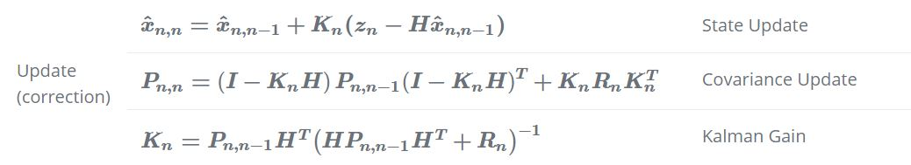

# Kalman Filter
The Kalman filter is a sequential estimation process that provides an optimal estimate 
of the evolution of a system, given noisy measurements and a limited knowledge about the system. 
The standard Kalman filter is designed for linear systems and is now widely 
used in many different applications, including Tracking Targets, navigation systems and much more.

## Getting started
The simulation can be used with the following requirements:
* Python3
* Miniconda

(It could work with Anaconda but it was not tested).

To start the simulation, execute the following commands:

```shell
# Clone the repository
git clone https://github.com/ElisaSpecchia/UnidimensionalKalmanFilter.git
cd ./UnidimensionalKalmanFilter

# Create the Conda environment
conda create --name kalman --file requirements.txt
conda activate kalman

# Start the app
python src/main.py
```

After main, click on the link  (http://127.0.0.1:5000/) shown in console.

# descrivere l'interfaccio

### Tests

To run the test suite, use the following command:
```shell
# On Windows
./run_tests.bat

# On macOS and Linux
./run_tests.sh
```


## Introduction
Many systems are equipped with different sensors that measure various parameters of interest, typically 
referred to as states. A sensor specifically produces measurements containing some uncertainty, so
the standard Kalman filter combines all available information about a 
linear dynamic system, both its dynamics model and any 
measurements, into an optimal estimate of the states. All estimated states of the system 
form the estimated state vector (X).

The key to a Kalman filter is that it also tracks an estimate of the uncertainty 
associated with a state, in addition to providing an estimate of that state. The uncertainty 
can be defined by a matrix known as the state covariance matrix (P), that combines the variances 
associated with each of the state estimates and the correlation between the errors in the 
state estimates.

Thus, the Kalman filter is intended to optimize the estimate of the state vector, provided the state 
covariance matrix, the system dynamic model, and noisy measurements (z) with their associated 
measurement covariance matrix (R). This is achieved through a continuous two-step process: 
1. propagate the state and covariance with the dynamic model from one time step to the next,
2. perform a measurement update at each time step.

During the propagation process, a mathematical model is applied over a specified period of time 
to predict the next state vector and state covariance matrix of the system. This model, implemented
in the state transition matrix (F), defines how the state vector changes over time. In this step, 
the next state vector and state covariance matrix can be predicted using the following equations, 
with n indicating the current time step: 


* X  =  State Vector
* P  =  Estimate Uncertainty
* F  =  State Transition Matrix

(Notice the State Vector and Estimate Uncertainty have two subscripts. The first one corresponds
to the time step of the estimate, while the second one is the time step of the last
measurement considered in the same estimate).


The propagation step is followed by the update step, which corrects the prediction of the 
state vector and state covariance matrix with all available measurement data, in order to provide
the best estimate of these parameters. Each of the measurements taken from a sensor is stored in 
a measurement vector (Z), which typically requires a conversion in order to be compared to a state.
The observation matrix (H) converts the state vector of the system (X) into the measurement vector 
(Z) using linear transformations:


where n indicates the time step.

The Kalman filter assumes that the measurement errors in the system are Gaussian and zero-mean.
The uncertainty in each of the measurements is defined by the measurement covariance matrix (R).
Once the measurement vector, observation matrix, and measurement covariance matrix 
are available, the propagated state vector and state covariance matrix can be corrected 
with this measurement information to provide an updated estimate of the states and state covariance.
The combination of measurements and predictions requires a matrix known as the Kalman gain (K),  
in order to weight the measurements by comparing the uncertainty of the measurement
vector (R) with the current uncertainty of the state vector (P). The Kalman gain is designed 
such that it minimizes the variance of the state estimates.
The following equations describe the update step, with n corresponding to the current time step:



(As in the propagation step, the State Vector and Estimate Uncertainty have two subscripts. 
The first one refers to the time step of the estimate, while the second one is the time step 
of the last measurement considered in the same estimate).


To summarize, the Kalman filter has to be initialized with both an initial state estimate and its
covariance matrix. Once initialized, it shall predict the system state and uncertainty at the 
next time step. When the measurement is received, the Kalman filter updates the estimate and 
its uncertainty. As well, the updated estimate is used to predict the 
next state, and so on. 

Thus, the application of a filter requires several input parameters:
* Initial state estimate,
* Initial state covariance matrix,
* State transition matrix,
* Measurement vector,
* Measurement covariance matrix,
* Observation matrix. 

The following diagram provides a complete picture of the Kalman Filter operation.


# Unidimensional simulation
This simulation deals with the application of the kalman filter with the purpose of tracking 
the motion of a whale, on which a GPS receiver has been placed to directly measure the position 
and velocity. For simplicity, the motion is assumed to be along one dimension. In this particular 
case, the following observation matrix (H) and state transition matrix (F) are used:


where Δt is the interval between one estimate and the next one (which corresponds to the interval 
between one measurement and the next one)

So, in this particular system, the estimated state vector (X) includes position (p) and velocity (v), 
while the state covariance matrix (P) combines the variances associated with 
each of the state estimates (σ2p  and σ2v) and the correlation between the position and velocity errors
σpσv.


